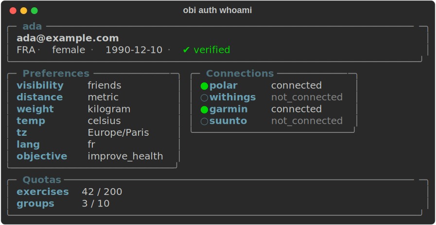

<div class="obi-hero">
  
  <h1>obi</h1>
  <p>The command-line client for the <strong><a href="https://obitrain.com">Obitrain API</a></strong>:<br />
  authenticate once, call any endpoint, and discover the API contract offline.</p>
</div>

```bash
uv tool install obitrain      # exposes the `obi` binary

obi auth login                # approve a short code in the Obitrain app — no password
obi api /v1/training/sessions -q limit=5
```

<div class="obi-cards">
  <a href="user-quickstart/">
    <strong>User quickstart</strong>
    Install <code>obi</code>, sign in, discover endpoints, and make your first requests.
  </a>
  <a href="agent-quickstart/">
    <strong>Agent quickstart</strong>
    Use the CLI from an AI agent with JSON output, stable exit codes, and recovery hints.
  </a>
  <a href="auth/">
    <strong>Authentication</strong>
    Device-code login, API tokens, profiles, and ephemeral credentials.
  </a>
  <a href="api/">
    <strong>Making requests</strong>
    One generic <code>obi api</code> command: methods, query params, bodies, dry-run.
  </a>
  <a href="schema/">
    <strong>Discovering the API</strong>
    Search endpoints and inspect parameters, payloads, responses, and schemas offline.
  </a>
</div>

## One interface for the whole API

- **User-friendly.** Common checks are one short command away — `obi auth whoami` shows who you
  are signed in as:

    

- **Readable in a terminal.** Tables and highlighted output are used on a TTY, with enum codes
  labeled (`friends (2)`, not just `2`).
- **Easy to explore.** `obi schema` searches the bundled OpenAPI contract, so discovery works
  without network access.
- **Scriptable.** Response bodies go to stdout, diagnostics go to stderr, and explicit output
  formats are available with `--json` and `-o`.
- **Safe to operate.** Tokens are stored per profile with `0600` permissions, and `-n` dry-runs a
  request before it is sent.

`obi` was also designed for reliable use by AI agents. The [agent quickstart](agent-quickstart.md)
documents the machine-facing output, exit-code, discovery, and error-recovery conventions.
